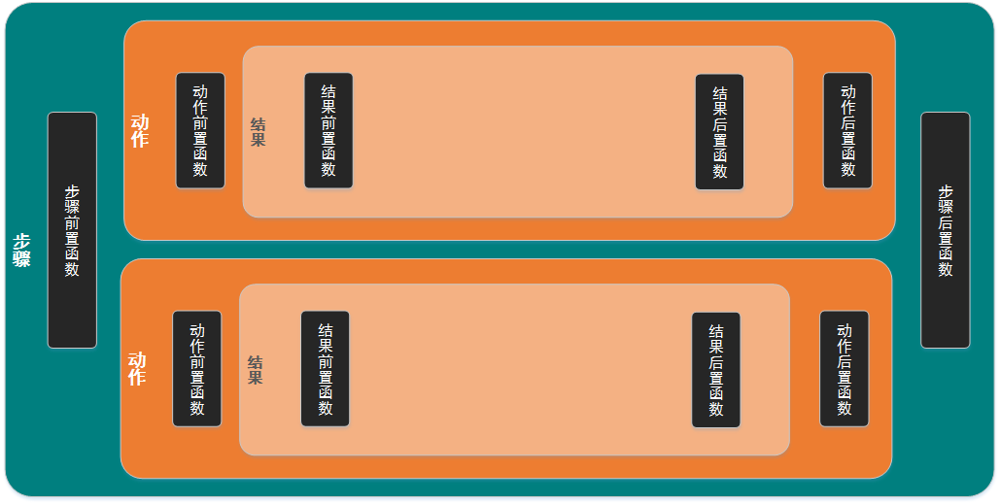

# 概述

工作流（WorkFlow）就是工作流程的计算模型，即将工作流程中的工作如何前后组织在一起的逻辑和规则在计算机中以恰当的模型进行表示并对其实施计算。工作流要解决的主要问题是：为实现某个业务目标，在多个参与者之间，利用计算机，按某种预定规则自动传递。

许多公司采用纸张表单，手工传递的方式，一级一级审批签字，工作效率非常低下，对于统计报表功能则不能实现。而采用工作流软件，使用者只需在电脑上填写有关表单，会按照定义好的流程自动往下跑，下一级审批者将会收到相关资料，并可以根据需要修改、跟踪、管理、查询、统计、打印等，大大提高了效率，实现了知识管理，提升了公司的核心竞争力。

## mitlab-workflow概述

mitlab-workflow是我们自研发的工作流框架，它的实现思路来源于老牌工作流引擎osworkflow。但mitlab-workflow又区别于osworkflow，它有以下优点：

- 简单、轻量、整个架构从学到精几天，学习成本低
- 目前与分布式框架DUBBO融为一化，可以稍改移至HSF，与分布式架框结合
- 支持子流程、支持流程自动图形化展示；可以结合gojs或mxgraph完成图形化流程设计【暂未支撑】
- 经过OOP、中航、ESB门户等面向企业的特殊需求的验证
- 形成了一套开发使用模式

## 功能列表

- 基于分布式架构研发
- 与spring整合
- 图形化流程展示
- 支持子流程
- 支持流程实例生命周期展示

## 交流与参与

- 讨论QQ群： 546920762（仅限于mitlab-workflow，请尽量讨论与Emitlab-workflow相关的话题。我们希望您在申请加群之前仔细阅读文档，并在加群申请中正确回答问题，以及在申请时写上您的姓名和公司名称。并且在入群后及时修改群名片。否则我们将有权拒绝您的入群申请。谢谢合作。）
- 报告确定的bug，提交增强功能建议和提交补丁等，请阅读如何进行贡献。

# 贡献代码

您可以报告bug，提交一个新的功能增强建议或者直接对以上内容提交改进补丁。

## 报告Bug

本章节介绍如何提交一个bug。

### 报告一个新bug之前

- 确定在最新版本中该bug存在。我们将不会持续维护所有的发布版本，所有的修改仅根据当前版本。
- 确认该bug是可以复现的。请尽量提供完整的重现步骤。
- 请确定这不是一个重复的bug。 查看Issue Page列表，搜索您要提交的bug是否已经被报告过。

### 如何提交一个有质量的bug

请在Issue Page页面中提交bug。

- 使用一个清晰并有描述性的标题来定义bug。
- 详细的描述复现bug的步骤。包括您使用的SQL，配置情况，预计产生的结果，实际产生的结果。并附加详细的TRACE日志。
- 如果程序抛出异常，请附加完整的堆栈日志。
- 如有可能，请附上屏幕截图或动态的GIF图，这些图片能帮助演示整个问题的产生过程。
- 如果涉及性能问题，请附加上CPU，内存或网络磁盘IO的Profile截图。
- 说明适用的版本，只有release版本的bug才可以提交，并且应该是当前最新版本。
- 说明适用的操作系统，及其版本。
- 使用bug标签(Label)来标记这个issue。

以下是bug的Markdown模板，请按照该模板填写issue。

```
[问题简单描述]

**问题复现步骤:**

1. [第一步]
2. [第二步]
3. [其他步骤...]

**期望的表现:**

[在这里描述期望的表现]

**观察到的表现:**

[在这里描述观察到的表现]

**屏幕截图和动态GIF图**


**Elastic-Job版本:** [输入Elastic-Job的版本]
**操作系统及版本:** [输入操作系统及版本]
```

## 提交功能增强建议

提交功能增强建议。

### 提交一个功能增强建议之前

- 请确定这不是一个重复的功能增强建议。 查看Issue Page列表，搜索您要提交的功能增强建议是否已经被提交过。

### 如何提交一个好的功能增强建议

请在Issue Page页面中提交功能增强建议。

- 使用一个清晰并有描述性的标题来定义增强建议。
- 详细描述增强功能的行为模式。
- 解释说明为什么该功能是对大多数用户是有用的。新功能应该具有广泛的适用性。
- 如有可能，可以列出其他数据库中间已经具备的类似功能。商用与开源软件均可。
- 使用enhancement标签(Label)来标记这个issue。

以下是功能增强建议的Markdown模板，请按照该模板填写issue。

```
[简单的建议描述]

**建议的新功能行为**

[描述新功能应表现的行为模式]

**为什么这个新功能是对大多数用户有用的**

[解释这个功能为什么对大多数用户是有用的]

[列出其他的数据库中间件是否包含该功能，且如何实现的]
```

## 贡献补丁(Patch)

本章节向贡献者介绍开发规范、环境、示例和文档。

### 开发理念

- 用心写代码，提炼真正的非功能性需求。
- 代码整洁干净到极致, 请参见《重构》和《代码整洁之道》。
- 极简代码, 高度复用，无重复代码和配置。
- 代码应在同一抽象层级。
- 修改功能时多考虑影响面, 不可留下没修改完全的部分。
- 只有一个需求时，不需扩展性。两个类似需求时, 再提炼扩展性。

### 开发行为规范

- 提交之前先确定模块的测试套件，并使用测试覆盖率工具检查覆盖率不能低于master分支的覆盖率。
- 使用Checkstyle检查代码, 违反验证规则的需要有特殊理由。模板:mitlab_checks.xml。
- 执行mvn clean install可以测试和编译通过。
- 及时删除无用代码。

### 编码规范

- 写代码之前看一下系统已有的代码, 保持风格和使用方式一致。
- 变量命名要有意义, 如果方法只有唯一的返回值, 使用result命名返回值. 循环中使用each命名循环变量, map中使用entry代替each。
- 嵌套循环尽量提成方法。
- 优先使用卫语句。
- 配置文件使用驼峰命名, 文件名首字母小写。
- 类和方法的访问权限控制为最小, 例如: 可以设为包私有的就不用public。
- 方法所用到的私有方法应紧跟着该方法, 如果有多个私有方法, 书写私有方法应与私有方法在原方法的出现顺序相同。
- 优先使用guava而非apache commons, 如：优先使用Strings而非StringUtils。
- 优先使用lombok代替构造器, get, set, log方法。
- 使用linux换行符。
- 缩进（包含空行）和上一行保持一致。
- 不应有无意义的空行。
- 方法入参和返回值不允许为null，如有特殊情况需注释说明。
- 需要注释解释的代码尽量提成小方法，用方法名称解释，注释应只包含javadoc和todo，fixme等。
- 禁止使用static import。
- 不需要公开的类放入internal包，包中类尽量包私有。
- 日志一律使用英文。
- 使用annotation获取spring的业务bean。
- 如果模块中有公用的切入点，应在模块一级路径创建pointcut包。
- 属性配置项需要添加到各个模块的常量枚举中。

### 单元测试规范

- 测试代码和生产代码需遵守相同代码规范。
- 如无特殊理由, 测试需全覆盖。
- 准备环境的代码和测试代码分离。
- 单数据断言, 应使用assertTrue, assertFalse, assertNull, assertNotNull。
- 多数据断言, 应使用assertThat。
- 精确断言, 尽量不使用not, containsString断言。
- 调用业务方法的变量, 应命名为actualXXX, 期望值应命名为expectedXXX。
- 只有junit assertXXX, hamcrest, mocktio相关可以使用static import。

### 编译代码

mitlab-workflow的代码编译需要Maven，请保证IDE中正确配置了它。 代码用到的所有依赖完全都可以从公网下载，请根据自身的网络情况选择合理的镜像。代码使用了Lombok来生成类属性的访问方法，构造器等。 故请以上从链接内容来获取适合您的IDE的解决方法。

### 文档生成

文档使用博客生成引擎HUGO，请根据文档安装环境。 文档全部在mitlab-workflow/mitlab-workflow-doc/public目录中。

### 贡献代码

请按照规范贡献代码，示例和文档。

- 所有的问题与新功能请使用Issue Page进行管理。
- 任何人想要开发任何功能，请先回复该功能所关联的Issue，表明您当前正在这个Issue上工作。 并在回复的时候为自己设置一个deadline，并添加的回复内容中。
- 在核心贡献者找到一个导师(shepherd)，导师会在设计与功能实现上给予即时的反馈。
- 您应该新建一个分支来开始您的工作，分支的名字为功能名称/issueId。 例如，您想完成作业依赖功能并提交了Issue 111，那么您的branch名字应为 dependency/111。 功能名称与导师讨论后确定。
- 完成后，发送一个pull request到mitlab.com/mitlab-workflow
- 接着导师做CodeReview，然后他会与您讨论一些细节（包括设计，实现，性能等）。当团队中所有人员对本次修改满意后，导师会将提交合并到master分支。
- 最后，恭喜您已经成为了Elastic-Job的官方贡献者！

# 开发指南

## 环境需求

### Java

请使用JDK1.7及其以上版本。

### Maven

请使用Maven 3.0.4及其以上版本。

## mitlab-workflow基本概念

mitlab-workflow由步骤、动作、结果、条件、函数组成。

### 步骤

步骤是一个业务的审批环节，如：财务部审批、部门经理审批。步骤分为开始步骤、普通步骤、结束步骤三种类型。开始步骤是一个流程的起点；结束步骤是流程的终点；普通步骤是中间处理环节。步骤由前置函数、后置函数及动作三部分组成。

### 动作

动作即每个环节的可操作项；如：部门经理审批【通过、打回】，此处通过、打回等具体操作，就是动作。动作由前置函数、后置波函数、结果集三部分组成。

### 结果

结果，每个动作产生的流转，即为结果；如：部门经理审批【通过】到达财务部审批，这个连接，就是动作产生的结果。一个动作可以有多个结果，但只有一个结果生效。按顺序第一个符合条件的结果是动作执行的结果。

### 条件

一个动作，可能产生A结果，也可能产生B结果；如部门经理审批【通过】，如果金额大于100万，需要财务部总监审批，否则由财务部审批。一个步骤下面，可以有多个可执行的动作，不同角色的人员执行的动作列表不相同。结果的导向控制或活动可执行与否的控制即为条件。一个条件可以用于控制动作是否可执行，也可控制结果导向。

### 函数

一个步骤、动作或结果的执行，可以指向执行一个操作，这个操作，称为函数。函数分为：步骤函数、动作函数、结果函数。每种函数又分为前置执行、后置执行两种，即在具体步骤、动作、结果执行前还是执行后调用函数。



## 数据库结果说明

mitlab-workflow核心业务由五张表组成：工作流实例表、当前步骤表、历史步骤表、步骤参数表、步骤组用户表。工作流表的存储引擎：innodb，字符编码为utf8。

### 工流实例表

表结构（t_workflow）：

| 字段                     | 字段类型        | 是否必填 | 描述                                       |
| ---------------------- | ----------- | ---- | ---------------------------------------- |
| id                     | bigint      | Y    | 流程实例ID，自增                                |
| workflow_name          | varchar(64) | Y    | 流程实例名称，流程文件中配置的名称                        |
| workflow_status        | varchar(10) | Y    | 工作流状态：UNKNOW("unknow"), CREATED("created"), COMPLETED("completed"), KILLED("killed"), SUSPENDED("suspended"), ACTIVATED("activated")。实体类：com.mitlab.workflow.FlowStatus。 |
| workflow_phase         | varchar(10) | Y    | 工作流所处阶段：ON_START("onStart"), ON_ACTION("onAction"), ON_COMPLETE("onComplete")。实体类：com.mitlab.workflow.FlowPhase |
| crt_time               | datetime    | Y    | 流程创建时间                                   |
| main_flow_id           | bigint      | N    | 主流程ID，当前流程为子流程时此字段有值，主要用于子流程完成后，合并执行主流程及子流程步骤查询。 |
| main_flow_join_step_id | bigint      | N    | 主流程全并步骤ID，当前流程为子流程时此字段有值。主要用于子流程完成后，合并执行主流程。 |

### 当前步骤表

表结构（t_current_step）：

| 字段          | 字段类型         | 是否必填 | 描述                           |
| ----------- | ------------ | ---- | ---------------------------- |
| id          | bigint       | Y    | 当前步骤ID，自增                    |
| step_id     | varchar(32)  | Y    | 流程配置文件中的步骤ID                 |
| step_name   | varchar(64)  | Y    | 流程配置文件中的步骤名称                 |
| user_group  | varchar(128) | Y    | 调用当前步骤所需的用户组                 |
| caller      | varchar(32)  | Y    | 步骤的执行者                       |
| start_date  | datetime     | N    | 步骤的开始时间                      |
| due_date    | datetime     | N    | 步骤处理时间                       |
| finish_date | datetime     | N    | 步骤完成时间                       |
| status      | archar(32)   | N    | 步骤所处理的状态，取自配置文件result的status |
| workflow_id | bigint       | Y    | 步骤归属的流程                      |
| action_id   | bigint       | N    | 执行该步骤的动作                     |
| prev_id     | bigint       | N    | 上一步步骤，串成历史步骤调整链              |

### 历史步骤表

表结构（t_history_step）：

| 字段          | 字段类型         | 是否必填 | 描述                               |
| ----------- | ------------ | ---- | -------------------------------- |
| id          | bigint       | Y    | 历史步骤ID，自增                        |
| step_id     | varchar(32)  | Y    | 流程配置文件中的步骤ID                     |
| step_name   | varchar(64)  | Y    | 流程配置文件中的步骤名称                     |
| user_group  | varchar(128) | Y    | 调用当前步骤所需的用户组                     |
| caller      | varchar(32)  | Y    | 步骤的执行者                           |
| start_date  | datetime     | N    | 步骤的开始时间                          |
| due_date    | datetime     | N    | 步骤处理时间                           |
| finish_date | datetime     | N    | 步骤完成时间                           |
| status      | archar(32)   | N    | 步骤所处理的状态，取自配置文件result的old-status |
| workflow_id | bigint       | Y    | 步骤归属的流程                          |
| action_id   | bigint       | N    | 执行该步骤的动作                         |
| prev_id     | bigint       | N    | 上一步步骤，串成历史步骤调整链                  |

### 步骤组用户表

表结构（t_step_user_group）：

| 字段               | 字段类型        | 是否必填 | 描述               |
| ---------------- | ----------- | ---- | ---------------- |
| step_id          | bigint      | Y    | 归属步骤的ID          |
| refer_user       | varchar(32) | Y    | （可操作或已操作）归属步骤的用户 |
| refer_user_group | varchar(32) | Y    | 用户分组             |
| crt_time         | datetime    | Y    | 创建时间             |
| workflow_id      | bigint      | Y    | 归属的流程            |

### 步骤参数表

表结构（t_step_args）：

| 字段          | 字段类型     | 是否必填 | 描述                   |
| ----------- | -------- | ---- | -------------------- |
| workflow_id | bigint   | Y    | 流程实例ID               |
| step_id     | bigint   | Y    | 归属步骤的ID              |
| step_args   | longblob | Y    | 调用该步骤时的参数            |
| args_type   | int      | Y    | 归属步骤类型：0 当前步骤；1 历史步骤 |

## 使用指南

mitlab-workflow可以用在HSF、DUBBO或本地嵌入三方模式下，本例使用DUBBO模式为例进行介绍。

### 服务端

1、创建工作流配置文件（spring-workflow-service.xml）

内容如下：

```
<?xml version="1.0" encoding="UTF-8"?>
<beans xmlns="http://www.springframework.org/schema/beans"
	xmlns:aop="http://www.springframework.org/schema/aop" 
	xmlns:tx="http://www.springframework.org/schema/tx"
	xmlns:jee="http://www.springframework.org/schema/jee"
	xmlns:xsi="http://www.w3.org/2001/XMLSchema-instance"
	xsi:schemaLocation="http://www.springframework.org/schema/beans 
		http://www.springframework.org/schema/beans/spring-beans-2.5.xsd
		http://www.springframework.org/schema/jee http://www.springframework.org/schema/jee/spring-jee-3.0.xsd
		http://www.springframework.org/schema/tx http://www.springframework.org/schema/tx/spring-tx-2.5.xsd
       http://www.springframework.org/schema/aop http://www.springframework.org/schema/aop/spring-aop-2.5.xsd">
       
	<!-- workflow impl -->
	<bean id="MoreThanOneStepUserCondition" class="com.mitlab.workflow.conditions.MoreThanOneStepUserCondition"/>
    <bean id="PermissionCondition" class="com.mitlab.workflow.conditions.PermissionCondition"/>
    <bean id="StepUserCondition" class="com.mitlab.workflow.conditions.StepUserCondition"/>
    <bean id="LayoffStepUserFunction" class="com.mitlab.workflow.functions.LayoffStepUserFunction"/>
    <bean id="TestStepUserFunction" class="com.mitlab.workflow.functions.TestStepUserFunction"/>
    <bean id="LastStepCallerFunction" class="com.mitlab.workflow.functions.LastStepCallerFunction"/>
    <bean id="KillSubflowFunction" class="com.mitlab.workflow.functions.KillSubflowFunction"></bean>
    <bean id="JoinCondition" class="com.mitlab.workflow.conditions.JoinCondition"/>
    <bean id="jdbcWorkflowProvider" class="com.mitlab.workflow.JdbcWorkflow">
    	<constructor-arg>
    		<bean class="com.mitlab.workflow.BasicUserGroupLoader"/>
    	</constructor-arg>
    	<!--数据源需要根据实际调整-->
    	<constructor-arg ref="workflowDataSource"/>
    </bean>
</beans>
```

2、将工作流操作接口暴露为DUBBO服务

```
<?xml version="1.0" encoding="UTF-8"?>
<beans xmlns="http://www.springframework.org/schema/beans"
	xmlns:xsi="http://www.w3.org/2001/XMLSchema-instance" 
	xmlns:dubbo="http://code.alibabatech.com/schema/dubbo"
	xmlns:jee="http://www.springframework.org/schema/jee"
	xsi:schemaLocation="http://www.springframework.org/schema/beans        
	http://www.springframework.org/schema/beans/spring-beans.xsd
	http://www.springframework.org/schema/jee http://www.springframework.org/schema/jee/spring-jee-3.0.xsd
	http://code.alibabatech.com/schema/dubbo        
		http://code.alibabatech.com/schema/dubbo/dubbo.xsd">
		
	<dubbo:service interface="com.mitlab.workflow.Workflow" ref="jdbcWorkflowProvider" />
	<import resource="classpath:spring-workflow-service.xml"/>
</beans>
```

3、在workflows文件夹下创建流程，如：workflow_demo.xml

```
<?xml version="1.0" encoding="UTF-8"?>
<workflow xmlns="http://www.mitlab.org/workflow" xmlns:xsi="http://www.w3.org/2001/XMLSchema-instance"
	xsi:schemaLocation="http://www.mitlab.org/workflow mitlab-workflow.xsd "
	name="workflow_demo">
	<start-step id="startStep" name="创建DEMO申请单">
		<actions>
			<action id="act_startStep" name="创建">
				<meta key="act_startStep" value="act_startStep" />
				<conditions type="OR">
					<condition type="spring">
						<arg name="bean.id" value="PermissionCondition"/>
						<arg name="permission" value="security:index"/>
					</condition>
				</conditions>
				<results>
					<result old-status="Finish" status="running" user-group="demoUserGroup" step="secondStep">
						<pre-functions>
							<function type="spring">
								<arg name="bean.id" value="TestStepUserFunction" />
							</function>
						</pre-functions>
					</result>
				</results>
			</action>
		</actions>
	</start-step>
	
	<step id="secondStep" name="研发部审批">
		<meta key="editAdvise" value="true" />
		<meta key="editRemark" value="true" />
		<meta key="redoRemark" value="true"/>
		<actions>
			<action id="act_secondStep_001" name="同意">
				<results>
					<result name="会签" old-status="MoreThanOneStepUserCondition" status="running" step="secondStep" user-group="secondStep">
						<conditions>
							<condition type="spring">
								<arg name="bean.id" value="MoreThanOneStepUserCondition" />
							</condition>
						</conditions>
						<pre-functions>
							<function type="spring">
								<arg name="bean.id" value="LayoffStepUserFunction" />
								<arg name="group" value="demoUserGroup"/>
							</function>
						</pre-functions>
					</result>
					<result name="会签结束" old-status="stopStep" status="running" step="thirdStep" user-group="thirdStep"/>
				</results>
			</action>
		</actions>
	</step>
	
	<step id="thirdStep" name="质量保障部审批">
		<meta key="editAdvise" value="false" />
		<meta key="editRemark" value="true" />
		<actions>
			<action id="act_thirdStep_001" name="同意">
				<meta key="act_thirdStep_001" value="act_thirdStep_001" />
				<results>
					<!-- <result old-status="stopStep" status="running" step="fourStep" user-group="stopStep"/> -->
					<result old-status="stopStep" status="running" step="fourStep" user-group="stopStep" subflows="subflow-d1,subflow-d2"/>
				</results>
			</action>
			<action id="act_thirdStep_002" name="退回">
				<meta key="act_thirdStep_001" value="act_thirdStep_001" />
				<results>
					<result old-status="stopStep" status="running" step="secondStep" user-group="stopStep">
						<pre-functions>
							<function type="spring">
								<arg name="bean.id" value="LastStepCallerFunction"/>
							</function>
						</pre-functions>
					</result>
				</results>
			</action>
			<action id="act_thirdStep_003" name="终止">
				<meta key="act_thirdStep_001" value="act_thirdStep_001" />
				<results>
					<result old-status="stopStep" status="running" step="stopStep" user-group="stopStep"/>
				</results>
			</action>
		</actions>
	</step>
	
	<step id="fourStep" name="公司管理层审批">
		<meta key="editAdvise" value="true" />
		<meta key="editRemark" value="true" />
		<actions>
			<action id="act_thirdStep_001" name="同意">
				<conditions>
					<condition type="spring">
						<arg name="bean.id" value="JoinCondition"/>
					</condition>
				</conditions>
				<meta key="act_thirdStep_001" value="act_thirdStep_001" />
				<results>
					<result old-status="stopStep" status="running" step="fiveStep" user-group="stopStep"/>
				</results>
			</action>
		</actions>
	</step>
	
	<step id="fiveStep" name="总裁办审批">
		<meta key="editAdvise" value="true" />
		<meta key="editRemark" value="true" />
		<actions>
			<action id="fiveStep-ACT_001" name="同意">
				<meta key="fiveStep-ACT_001" value="act_thirdStep_001" />
				<results>
					<result old-status="stopStep" status="running" step="stopStep" user-group="stopStep"/>
				</results>
			</action>
			<action id="fiveStep-ACT_002" name="退回">
				<meta key="fiveStep-ACT_001" value="act_thirdStep_001" />
				<results>
					<result old-status="stopStep" status="running" step="fourStep" user-group="stopStep">
						<pre-functions>
							<function type="spring">
								<arg name="bean.id" value="LastStepCallerFunction"/>
							</function>
						</pre-functions>
					</result>
				</results>
			</action>
			<action id="fiveStep-ACT_003" name="退回研发部">
				<meta key="fiveStep-ACT_001" value="act_thirdStep_001" />
				<results>
					<result old-status="stopStep" status="running" step="secondStep" user-group="stopStep">
						<pre-functions>
							<function type="spring">
								<arg name="bean.id" value="LastStepCallerFunction"/>
							</function>
						</pre-functions>
					</result>
				</results>
			</action>
		</actions>
	</step>
	
	<stop-step id="stopStep" name="DEMO申请单结束" />
</workflow>
```

至此服务端的工作流程配置完成

### 客户端

1、创建流程实例

```
	@RequestMapping(value = "createDemoOrder.do")
	@Permission(name="创建DEMO流程", value="demoFlow:createDemoOrder", required=true,decorator="common")
	public ModelAndView createDemoOrder(HttpServletRequest request, WorkflowDemoOrder demoOrder) {
		if ("GET".equals(request.getMethod())) {
			ModelAndView view = new ModelAndView("createDemoOrderView");
			view.addObject("workflowGraph", workflow.horizontalFlowGraph("workflow_demo"));
			return view;
		}
		ModelAndView view = new ModelAndView("createdDemoOrderView");
		UserInfo userInfo = SecurityHelper.getInstance().getCurrentUser();
		ActionResult actionResult = workflow.startWorkflow("workflow_demo", null, SecurityHelper.getInstance().getCurrentUser().toWorkflowUser());
		if (!(actionResult.isSuccess() && com.mitlab.workflow.FlowPhase.ON_START == actionResult.getFlowPhase())) {
			logger.error("创建DEMO流程出错：{" + actionResult.isSuccess() + "," + actionResult.getDesc() + "}");
			view.setViewName("createDemoOrderFailView");
			view.addObject("workflowId", actionResult.getWorkflowId());
			return view;
		}
		demoOrder.setCreator(userInfo.getUsername());
		demoOrder.setCrtDate(new Date());
		demoOrder.setPhase(actionResult.getFlowPhase().toString());
		demoOrder.setStatus(actionResult.getNewStepStatus());
		demoOrder.setWorkflowId(actionResult.getWorkflowId());
		demoOrder = workflowDemoService.insertWorkflowDemoOrder(demoOrder);
		view.addObject("demoOrderId", demoOrder.getWorkflowDemoId());
		return view;
	}
```

2、审批流程

```
	@RequestMapping(value = "doDemoOrderAction.do", method = RequestMethod.POST)
	@Permission(name="执行demo流程", value="demoFlow:doDemoOrderAction",decorator="common")
	public ModelAndView doDemoOrderAction(WorkflowDemoOrder demoOrder,Long stepId, String actionId, HttpServletRequest request) {
		ModelAndView view = new ModelAndView("doDemoOrderActionView");
		WorkflowUser caller = SecurityHelper.getInstance().getCurrentUser().toWorkflowUser();
		Map<String, Object> inputs = new HashMap<String, Object>();
		assignPsValue(request, inputs, "ps.advise");
		assignPsValue(request, inputs, "ps.remark");
		assignPsValue(request, inputs, "ps.redoRemark");
		ActionResult actionResult = workflow.doAction(demoOrder.getWorkflowId(), stepId, actionId, inputs, caller);
		if (actionResult.isSuccess() && FlowPhase.ON_COMPLETE.toString().equals(actionResult.getFlowPhase())) {
			// 工作流结束
			workflowDemoService.insertWorkflowDemoOrder(demoOrder);
		}
		// 可以做一些修改的事件
		view.addObject("demoOrderId", demoOrder.getWorkflowDemoId());
		return view;
	}
```

3、查看流程

```
	@RequestMapping(value = "viewDemoOrder.do")
	@Permission(name="查看DEMO流程", value="demoFlow:viewDemoOrder", accessCheck=true, decorator="common")
	public ModelAndView viewDemoOrder(Long demoOrderId) {
		ModelAndView view = new ModelAndView("viewDemoOrderView");
		WorkflowDemoOrder demoOrder = workflowDemoService.selectWorkflowDemoOrderById(demoOrderId);
		view.addObject("demoOrder", demoOrder);
		WorkflowUser caller = SecurityHelper.getInstance().getCurrentUser().toWorkflowUser();
		List<Action> availableActions = workflow.getAvailableActionsWithSubflow(demoOrder.getWorkflowId(), null, caller);
		Long currentStepId = null;
		if (!availableActions.isEmpty()) {
			currentStepId = availableActions.get(0).getStepId();
			for (int i = 0; i < availableActions.size();) {
				if (currentStepId.longValue() == availableActions.get(i).getStepId().longValue()) {
					++i;
					continue;
				}
				availableActions.remove(i);
			}
		}
		view .addObject("currentStepId", currentStepId);
		view .addObject("availableActions", availableActions);
		view .addObject("historySteps", workflow.getHistoryStepsWithSubflow(demoOrder.getWorkflowId()));
		view.addObject("workflowGraph", workflow.horizontalFlowGraph(demoOrder.getWorkflowId()));
		if (currentStepId != null) {
			view.addAllObjects(workflow.editable(demoOrder.getWorkflowId(), currentStepId, null, caller));
		}
		return view;
	}
```

4、工作流待办工作

```
	@RequestMapping(value = "queryToDODemoOrder.do")
	@Permission(name="查询DEMO流程待办", value="demoFlow:queryToDODemoOrder",decorator="common")
	public ModelAndView queryToDODemoOrder() {
		ModelAndView view = new ModelAndView("queryToDODemoOrderView");
		WorkflowUser caller = SecurityHelper.getInstance().getCurrentUser().toWorkflowUser();
		Set<Long> workflowIds = workflow.getToDoWorkflows("workflow_demo", caller);
		view.addObject("demoFlowTodoList", workflowDemoService.queryDemoOrders(workflowIds));
		return view;
	}
```

至于前端页面的展示，可以根据实际情况定制。

## API讲解

### Workflow

#### 启动工作流接口

> 主要用于流程启动，当流程启动成功后，方可做业务处理，即ActionResult返回值为成功时，方可做业务。

```
/**
 * workflowName 工作流配置文件中定义的流程名
 * inputs 创建流程时，流程的入参
 * 流程的调用者，一般为当前用户
 */
public ActionResult startWorkflow(String workflowName, Map<String, Object> inputs, WorkflowUser caller)
```

样例：

```
if (!(actionResult.isSuccess() && com.mitlab.workflow.FlowPhase.ON_START == actionResult.getFlowPhase())) {
	logger.error("创建DEMO流程出错：{" + actionResult.isSuccess() + "," + actionResult.getDesc() + "}");					view.setViewName("createDemoOrderFailView");
	view.addObject("workflowId", actionResult.getWorkflowId());
	return view;
}
demoOrder.setCreator(userInfo.getUsername());
demoOrder.setCrtDate(new Date());
demoOrder.setPhase(actionResult.getFlowPhase().toString());
demoOrder.setStatus(actionResult.getNewStepStatus());
demoOrder.setWorkflowId(actionResult.getWorkflowId());
demoOrder = workflowDemoService.insertWorkflowDemoOrder(demoOrder);
```

#### 执行工作流动作

> 主要用于流程审批，当流程启动成功后，方可做业务处理，即ActionResult返回值为成功时，方可做业务。

```
/**
 * workflowId 启动工作流时产生的实例ID，此ID建议记入业务表，以备流程审批、查询等场景使用
 * stepId 待执行的步骤ID
 * actionId 待执行的动作ID
 * inputs 审批流程时的入参
 * caller 流程的调用者，一般为当前用户
 */
public ActionResult doAction(long workflowId, Long stepId, String actionId, Map<String, Object> inputs, WorkflowUser caller)
```

样例：

```
WorkflowUser caller = SecurityHelper.getInstance().getCurrentUser().toWorkflowUser();
Map<String, Object> inputs = new HashMap<String, Object>();
assignPsValue(request, inputs, "ps.advise");
assignPsValue(request, inputs, "ps.remark");
assignPsValue(request, inputs, "ps.redoRemark");
ActionResult actionResult = workflow.doAction(demoOrder.getWorkflowId(), stepId, actionId, inputs, caller);
if (actionResult.isSuccess() && FlowPhase.ON_COMPLETE.toString().equals(actionResult.getFlowPhase())) {
	// 工作流结束
	workflowDemoService.insertWorkflowDemoOrder(demoOrder);
}
		// 可以做一些修改的事件
```

#### 查询待办流程

> 查询用户的待办流程。

```
/**
 * workflowName 配置流程时的流程名
 * caller 流程的调用者，一般为当前用户
 * 返回待办的流程实例ID列表
 */
public Set<Long> getToDoWorkflows(String workflowName, WorkflowUser caller)
```

#### 查询已办流程

> 查询用户的待办流程。

```
/**
 * workflowName 配置流程时的流程名
 * caller 流程的调用者，一般为当前用户
 * 返回已办的流程实例ID列表
 */
public Set<Long> getDoneWorkflows(String workflowName, WorkflowUser caller)
```

#### 横向展示流程流转状态

> 结合页面展示流程的流转状态，展示用的JS组件：mermaid.js。

```
/**
 * workflowName 配置流程时的流程名
 * 返回mermaid所需的图形数据
 */
public String horizontalFlowGraph(String workflowName)
/**
 * workflowId 流程实例ID
 * 返回mermaid所需的图形数据
 */
public String horizontalFlowGraph(Long workflowId)
```

#### 纵向展示流程流转状态

> 结合页面展示流程的流转状态，展示用的JS组件：mermaid.js。

```
/**
 * workflowName 配置流程时的流程名
 * 返回mermaid所需的图形数据
 */
public String verticalFlowGraph(String workflowName)
/**
 * workflowId 流程实例ID
 * 返回mermaid所需的图形数据
 */
public String verticalFlowGraph(Long workflowId)
```

#### 获取当前用户的可操作动作

> 查询当前用户的可操作动作，用于页面选择。

```
/**
 * workflowId 流程实例ID
 * inputs 审批时所使用的参数
 * 流程的调用者，一般为当前用户
 * 返回调用者可操作的动作列表
 */
public List<Action> getAvailableActions(long workflowId, Map<String, Object> inputs, WorkflowUser caller)
/**
 * workflowId 流程实例ID
 * inputs 审批时所使用的参数
 * 流程的调用者，一般为当前用户
 * 返回调用者可操作的动作列表；如果当前流程包含子流程，将子流程可操作的动作一并返回
 */
public List<Action> getAvailableActionsWithSubflow(long workflowId, Map<String, Object> inputs, WorkflowUser caller)
/**
 * workflowId 流程实例ID
 * stepId 当前步骤ID
 * inputs 审批时所使用的参数
 * 流程的调用者，一般为当前用户
 * 返回调用者可操作的动作列表；如果当前流程包含子流程，将子流程可操作的动作一并返回
 */
 public List<Action> getAvailableActionsWithSubflow(long workflowId, Long stepId, Map<String, Object> inputs, WorkflowUser caller)
```

#### 获取当前步骤

> 查询调用者的当前步骤。

```
/**
 * workflowId 流程实例ID
 * 返回调用者当前步骤列表
 */
public List<Step> getCurrentSteps(long workflowId)
/**
 * workflowId 流程实例ID
 * 返回调用者当前步骤列表；如果当前流程包含子流程，将子流程当前步骤一并返回
 */
public List<Step> getCurrentStepsWithSubflow(long workflowId)
```

#### 获取历史步骤

> 查询调用者的历史步骤。

```
/**
 * workflowId 流程实例ID
 * 返回调用者历史步骤列表
 */
public List<Step> getHistorySteps(long workflowId)
/**
 * workflowId 流程实例ID
 * 返回调用者历史步骤列表；如果当前流程包含子流程，将子流程历史步骤一并返回
 */
public List<Step> getHistoryStepsWithSubflow(long workflowId)
```

#### 获取当前步骤可编辑参数

> 返回的参数为流程配置文件在步骤中配置的arg参数，参数名为KEY，BOOLEAN作为其值，可用于是否可编辑，当然也可用作其他用途，如是否必填等。

```
/**
 * workflowId 流程实例ID
 * step_id 当前步骤ID
 * inputs 审批流程入参
 * caller 调用者，一般为当前登录用户
 * 配置文件步骤中arg参数组成的Map<String,Boolean>数据
 */
public Map<String, Boolean> editable(long workflowId, long stepId, Map<String, Object> inputs, WorkflowUser caller)
/**
 * workflowId 流程实例ID
 * step_id 当前步骤ID
 * inputs 审批流程入参
 * considerAction 是否考虑，是否有可执行的动作，默认否，即同editable(workflowId, stepId, inputs, caller)
 * caller 调用者，一般为当前登录用户
 * 配置文件步骤中arg参数组成的Map<String,Boolean>数据
 */
public Map<String, Boolean> editable(long workflowId, long stepId, Map<String, Object> inputs, boolean considerAction, WorkflowUser caller)
```

### function

> 用于在步骤、动作或结果执行前、后回调执行的业务逻辑

#### 回调函数

```
/**
 * inputs 启动或审批流程时的入参
 * args 工作流运转的内置参数
 *     Workflow.ARG_WORKFLOW 当前工作流的实例，默认类型：JdbcWorkflow
 *     Workflow.ARG_WORKFLOW_ID 当前工作流的实例ID
 *     Workflow.ARG_WORKFLOW_DS 当前工作流使用的数据源，类型：DataSource
 *     Workflow.ARG_RESULT_DESCRIPTOR 配置文件中的结果，类型：ResultDescriptor
 *     Workflow.ARG_STEP_ID 当前处理步骤的ID，类型Long
 */
public void execute(Map<String, Object> inputs, Map<String, Object> args)
```

样例：指定审批完成后下步的处理人

```
package com.mitlab.workflow.functions;

import java.util.ArrayList;
import java.util.List;
import java.util.Map;

import com.mitlab.workflow.Function;
import com.mitlab.workflow.UserGroup;
import com.mitlab.workflow.Workflow;
import com.mitlab.workflow.WorkflowUser;
import com.mitlab.workflow.descriptor.ResultDescriptor;

public class TestStepUserFunction implements Function {
	private static final long serialVersionUID = 1L;

	@Override
	public void execute(Map<String, Object> inputs, Map<String, Object> args) {
		List<UserGroup> userGroupList = new ArrayList<UserGroup>();
		String group = (String) args.get("group");
		if (group == null) {
			group = ((ResultDescriptor) args.get(Workflow.ARG_RESULT_DESCRIPTOR)).getUserGroup();
		}
		WorkflowUser caller = (WorkflowUser) args.get(Workflow.ARG_ACTION_CALLER);
		userGroupList.add(new UserGroup(caller.getUsername(), group));
		userGroupList.add(new UserGroup(caller.getUsername(), group + 'X'));
		args.put(Workflow.ARG_LOADED_USER_GROUP, userGroupList);
	}

}
```

#### 系统内置函数

##### 强制退出子流程

> com.mitlab.workflow.functions.KillSubflowFunction

##### 子流程汇聚后方可执行

> com.mitlab.workflow.conditions.JoinCondition

##### 获取上步调用者，用于下步处理人

> com.mitlab.workflow.functions.LastStepCallerFunction

##### 自定义下步处理人

> com.mitlab.workflow.functions.TestStepUserFunction

##### 从当前步骤处理人中选取人员，作为下步处理人，用于会签

> com.mitlab.workflow.functions.LayoffStepUserFunction

### condition

> 条件判断，可用于动作或结果。用于动作时，决定用户是否有审批当前动作的权限。用于结果时，隐式的决定结果的流向；按从上到下的顺序匹配。

#### 回调函数

```
/**
 * inputs 启动或审批流程时的入参
 * args 工作流运转的内置参数
 *     Workflow.ARG_WORKFLOW 当前工作流的实例，默认类型：JdbcWorkflow
 *     Workflow.ARG_WORKFLOW_ID 当前工作流的实例ID
 *     Workflow.ARG_WORKFLOW_DS 当前工作流使用的数据源，类型：DataSource
 *     Workflow.ARG_RESULT_DESCRIPTOR 配置文件中的结果，类型：ResultDescriptor
 *     Workflow.ARG_STEP_ID 当前处理步骤的ID，类型Long
 */
 public boolean passesCondition(Map<String, Object> inputs, Map<String, Object> args, WorkflowUser caller)
```

样例：必须是有效用户

```
package com.mitlab.workflow.conditions;

import java.sql.Connection;
import java.sql.PreparedStatement;
import java.sql.ResultSet;
import java.sql.SQLException;
import java.util.Map;

import javax.sql.DataSource;

import com.mitlab.common.utils.DBUtil;
import com.mitlab.common.utils.MitlabException;
import com.mitlab.workflow.Condition;
import com.mitlab.workflow.Workflow;
import com.mitlab.workflow.WorkflowUser;

public class StepUserCondition implements Condition {
	private static final long serialVersionUID = 1L;

	@Override
	public boolean passesCondition(Map<String, Object> inputs, Map<String, Object> args, WorkflowUser caller) {
		boolean passCondition = false;
		DataSource ds = (DataSource) args.get(Workflow.ARG_WORKFLOW_DS);
		Long workflowId = (Long) args.get(Workflow.ARG_WORKFLOW_ID);
		Long stepId = (Long) args.get(Workflow.ARG_STEP_ID);
		String group = (String) args.get("group");
		Connection conn = null;
		PreparedStatement stmt = null;
		ResultSet rs = null;
		
		try {
			conn = ds.getConnection();
			if (group == null) {
				stmt = conn.prepareStatement("select 'x' from t_step_user_group where workflow_id = ? and step_id = ? and refer_user = ?");
				stmt.setLong(1, workflowId);
				stmt.setLong(2, stepId);
				stmt.setString(3, caller.getUsername());
			} else {
				stmt = conn.prepareStatement("select 'x' from t_step_user_group where workflow_id = ? and step_id = ? and refer_user = ? and refer_user_group = ?");
				stmt.setLong(1, workflowId);
				stmt.setLong(2, stepId);
				stmt.setString(3, caller.getUsername());
				stmt.setString(4, group);
			}
			rs = stmt.executeQuery();
			passCondition = rs.next();
		} catch (SQLException e) {
			throw new MitlabException("UserGroupCondition DBConnection Error", e);
		} finally {
			DBUtil.close(rs);
			DBUtil.close(stmt);
			DBUtil.close(conn);
		}
		return passCondition;
	}

}
```

#### 系统内置条件

##### 强制退出子流程

> com.mitlab.workflow.conditions.MoreThanOneStepUserCondition

##### 强制退出子流程

> com.mitlab.workflow.conditions.PermissionCondition

##### 强制退出子流程

> com.mitlab.workflow.conditions.StepUserCondition

##### 强制退出子流程

> com.mitlab.workflow.conditions.JoinCondition

### ActionResult

#### 	获取当前流程ID

```
public Long getWorkflowId()
```

#### 获取当前流程状态

```
public FlowStatus getFlowStatus()
```

#### 获取当前流程阶段

```
public FlowPhase getFlowPhase()
```

#### 获取执行结果描述

```
public String getDesc()
```

#### 获取下一步骤编码

```
public String getNewStepStepId()
```

#### 获取下一步骤状态

```
public String getNewStepStatus()
```

#### 获取下一步骤ID

```
public Long getNewStepId()
```

#### 获取当前步骤编码

```
public String getCurrentStepStepId()
```

#### 获取当前步骤状态

```
public String getCurrentStepStatus()
```

#### 获取当前步骤ID

```
public Long getCurrentStepId()
```

#### 处理结果是否成功

```
public boolean isSuccess()
```

#### 获取当前子流程列表

```
public List<Long> getSubflowIds()
```